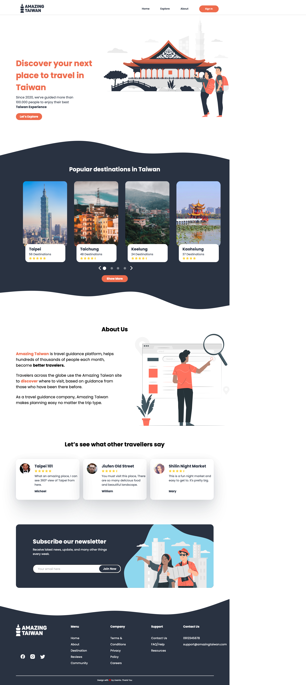

### Landing Page Travel

#### HTML/CSS

#### Structure landing page:
1. Header
   - Logo
   - Navigation menu
   - Auth button
2. Content
   - Banner
      1. Title travel service
      2. Description
      3. Action button
   - Popular destination in Taiwan
     1. Popular place card
        1. Title
        2. Amount destination
        3. Rating
   - About us
     1. Description 
   - Reviews
   - Subscribe block
3. Footer 
    - Logo
    - Social media link
    - Navigation menu in footer
4. Copyright design

